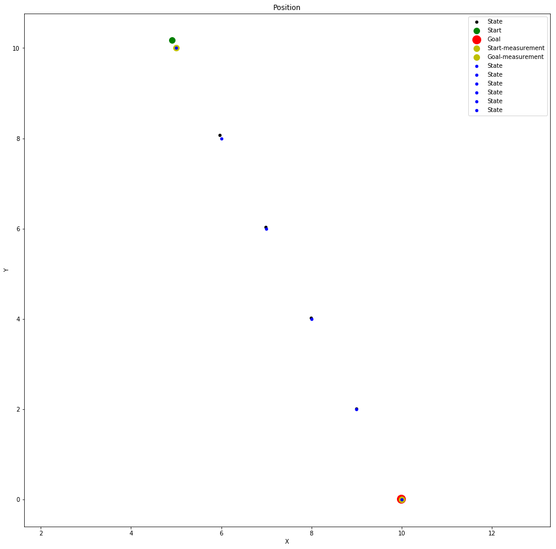

# Kalman Filter for Sensor Fusion

## Idea Of ​​The Kalman Filter In A Single-Dimension
Kalman filters are discrete systems that allows us to define a dependent variable by an independent variable, where by we will solve for the independent variable so that when we are given measurements (the dependent variable),we can infer an estimate of the independent variable assuming that noise exists from our input measurement and noise also exists in how we’ve modeled the world with our math equations because of inevitably unaccounted for factors in the non-sterile world.Input variables become more valuable when modeled as a system of equations,ora matrix, in order to make it possible to determine the relationships between those values. Every variables in every dimension will contain noise, and therefore the introduction of related inputs will allow weighted averaging to take place based on the predicted differential at the next step, the noise unaccounted for in the system,and the noise introduced by the sensor inputs.


```python
import numpy as np
import pandas as pd
import matplotlib.pyplot as plt
import matplotlib.mlab as mlab
import seaborn as sb
from scipy import stats
import time
from numpy.linalg import inv
```

### Despite noisy measurement of individual sensors, We can calculate an optimal estimate of all conditions.¶

https://in.udacity.com/course/artificial-intelligence-for-robotics--cs373

### Plot the Distributions in this range:¶


```python
x = np.linspace(-100,100,1000)
```


```python
%matplotlib inline
fw = 10 # figure width
```


```python
mean0 = 0.0   # e.g. meters or miles
var0  = 20.0
```


```python
plt.figure(figsize=(fw,5))
plt.plot(x,mlab.normpdf(x, mean0, var0), label='Normal Distribution')
plt.ylim(0, 0.1);
plt.legend(loc='best');
plt.xlabel('Position');
```


### Now we have something, which estimates the moved distance

1. The Mean is meters, calculated from velocity*dt or step counter or wheel encoder ...
2. VarMove is the Estimated or determined with static measurements¶


```python
meanMove = 25.0
varMove  = 10.0 
```


```python
plt.figure(figsize=(fw,5))
plt.plot(x,mlab.normpdf(x, meanMove, varMove), label='Normal Distribution')
plt.ylim(0, 0.1);
plt.legend(loc='best');
plt.xlabel('Distance moved');
```


```python
def predict(var, mean, varMove, meanMove):
    new_var = var + varMove
    new_mean= mean+ meanMove
    return new_var, new_mean
```


```python
new_var, new_mean = predict(var0, mean0, varMove, meanMove)
```


```python
plt.figure(figsize=(fw,5))
plt.plot(x,mlab.normpdf(x, mean0, var0), label='Beginning Normal Distribution')
plt.plot(x,mlab.normpdf(x, meanMove, varMove), label='Movement Normal Distribution')
plt.plot(x,mlab.normpdf(x, new_mean, new_var), label='Resulting Normal Distribution')
plt.ylim(0, 0.1);
plt.legend(loc='best');
plt.title('Normal Distributions of 1st Kalman Filter Prediction Step');
plt.savefig('Kalman-Filter-1D-Step.png', dpi=150)
```


## What you see: The resulting distribution is flat > uncertain.
The more often you run the predict step, the flatter the distribution get
First Sensor Measurement (Position) is coming in...
Sensor Defaults for Position Measurements
(Estimated or determined with static measurements)


```python
meanSensor = 25.0
varSensor  = 12.0
```


```python
plt.figure(figsize=(fw,5))
plt.plot(x,mlab.normpdf(x, meanSensor, varSensor))
plt.ylim(0, 0.1);
```


```python
def correct(var, mean, varSensor, meanSensor):
    new_mean=(varSensor*mean + var*meanSensor) / (var+varSensor)
    new_var = 1/(1/var +1/varSensor)
    return new_var, new_mean
```


```python
var, mean = correct(new_var, new_mean, varSensor, meanSensor)
```


```python
plt.figure(figsize=(fw,5))
plt.plot(x,mlab.normpdf(x, new_mean, new_var), label='Beginning (after Predict)')
plt.plot(x,mlab.normpdf(x, meanSensor, varSensor), label='Position Sensor Normal Distribution')
plt.plot(x,mlab.normpdf(x, mean, var), label='New Position Normal Distribution')
plt.ylim(0, 0.1);
plt.legend(loc='best');
plt.title('Normal Distributions of 1st Kalman Filter Update Step');
```


This is called the Measurement or Correction step! The Filter get's more serious about the actual state.

Let's put everything together: The 1D Kalman Filter
"Kalman-Filter: Predicting the Future since 1960"
Let's say, we have some measurements for position and for distance traveled. Both have to be fused with the 1D-Kalman Filter.


```python
positions = (10, 20, 30, 40, 50)+np.random.randn(5)
distances = (10, 10, 10, 10, 10)+np.random.randn(5)
```


```python
positions
```


    array([ 9.51953523, 20.15540678, 31.48438818, 38.96518302, 48.60434722])


```python
for m in range(len(positions)):
    
    # Predict
    var, mean = predict(var, mean, varMove, distances[m])
    #print('mean: %.2f\tvar:%.2f' % (mean, var))
    plt.plot(x,mlab.normpdf(x, mean, var), label='%i. step (Prediction)' % (m+1))
    
    # Correct
    var, mean = correct(var, mean, varSensor, positions[m])
    print('After correction:  mean= %.2f\tvar= %.2f' % (mean, var))
    plt.plot(x,mlab.normpdf(x, mean, var), label='%i. step (Correction)' % (m+1))
    
plt.ylim(0, 0.1);
plt.xlim(-20, 120)
plt.legend();
```

    After correction:  mean= 19.41	var= 7.29
    After correction:  mean= 24.91	var= 7.08
    After correction:  mean= 33.19	var= 7.05
    After correction:  mean= 40.86	var= 7.04
    After correction:  mean= 49.00	var= 7.04
    


The sensors are represented as normal distributions with their parameters (
μ
μ
 and 
σ
2
σ2
) and are calculated together with addition or convolution. The prediction decreases the certainty about the state, the correction increases the certainty.
Prediction: Certainty 
↓
↓
Correction: Certainty 
↑
↑


## Kalman Filter - Multi-Dimensional Measurement


#### Multidimensional Kalman filter
Let's assume we drive our car into a tunnel. The GPS signal is gone. Nevertheless, we might want to get notified that should exit in the tunnel.The procedure is using the example of a vehicle with navigation device, which enters a tunnel. The last known position is before losing the GPS signal. Afterwards (with permanently installed Navis) only the speed information of the vehicle (wheel speeds & yaw rate) is available as normal distributed noisy measured variable. From this a velocity in x and y can be calculated.
#### *How would we know now where we are right now?*
It merges the vehicle sensors and calculates the position as well as possible.
Now lets think, when we were at the tunnel entrance last and drive at 50km / h, then the car can indeed calculated exactly where (x = position) you are 1 minute (t = time) later
So far the perfect world. But the calculation takes over a microcontroller and this relies on sensors. Both the sensors have random errors, the transmission path has interference, and the resolution of CAN bus or analog-to-digital converters can cause many inaccuracies in the simple statement "speed". For example, a speed signal looks like this:
Speed-time course of a measurement Speed-time course of a measurement
On average, the measured speed is already correct, but there is some "noise". If one calculates a histogram of the determined speeds, one sees that the determined values ​​are approximately subject to a normal distribution.
Histogram of measured velocity with normal distribution Histogram of measured velocity with normal distribution
So there is one, and really only one, maximum value (unimodal) and a spread (variance). If this is the case, you can do the calculation very well with a trick nevertheless.


```python
xt = []
yt = []
dxt= []
dyt= []
Zx = []
Zy = []
Px = []
Py = []
Pdx= []
Pdy= []
Rdx= []
Rdy= []
Kx = []
Ky = []
Kdx= []
Kdy= []
```


```python
def filter(x, P):
    plt.scatter([x[0]], [x[1]], s=100)
    plt.title('Initial Location')

    for n in range(len(measurements)):

        # prediction
        x = (F * x) + u
        P = (F * P * F.transpose()) + Q
        

        # measurement update
        Z = np.matrix(measurements[n])
        
        y = Z.transpose() - (H * x)
       
        S = H * P * H.transpose() + R
        K = P * H.transpose() * inv(S)
        x = x + (K * y)
        P = (I - (K * H)) * P
               
        xt.append(float(x[0]))
        yt.append(float(x[1]))
        dxt.append(float(x[2]))
        dyt.append(float(x[3]))
        #Zx.append(float(Z[0]))
        #Zy.append(float(Z[1]))
        Px.append(float(P[0,0]))
        Py.append(float(P[1,1]))
        Pdx.append(float(P[2,2]))
        Pdy.append(float(P[3,3]))
        Rdx.append(float(R[0,0]))
        Rdy.append(float(R[1,1]))
        Kx.append(float(K[0,0]))
        Ky.append(float(K[1,0]))
        Kdx.append(float(K[2,0]))
        Kdy.append(float(K[3,0]))
        #print('X:',x)
        #print(P)


dt = 0.1
u = np.matrix([[0.], [0.], [0.], [0.]])
measurements = np.matrix([[5.0, 10.0], [6.0, 8.0], [7.0, 6.0], [8.0, 4.0], [9.0, 2.0], [10.0, 0.0]])
#measurements = np.matrix([[1., 4.], [6., 0.], [11., -4.], [16., -8.]])
#measurements = np.matrix([[1., 17.], [1., 15.], [1., 13.], [1., 11.]])
o = [[5.0, 10.0], [6.0, 8.0], [7.0, 6.0], [8.0, 4.0], [9.0, 2.0], [10.0, 0.0]]

x = np.matrix([[4.], [12.], [0.0], [0.0]])# initial state (location and velocity)
#x = np.matrix([[-4.], [8.], [0.0], [0.0]])
#x = np.matrix([[1.], [19.], [0.0], [0.0]])

P = np.matrix([[0.0, 0.0, 0.0, 0.0],
              [0.0, 0.0, 0.0, 0.0],
              [0.0, 0.0, 1000, 0.0],
              [0.0, 0.0, 0.0, 1000]]) # initial uncertainty: 0 for positions x and y, 1000 for the two velocities

F = np.matrix([[1.0, 0.0, dt, 0.0],
              [0.0, 1.0, 0.0, dt],
              [0.0, 0.0, 1.0, 0.0],
              [0.0, 0.0, 0.0, 1.0]]) # next state function: generalize the 2d version to 4d


H = np.matrix([[1.0, 0.0, 0.0, 0.0], [0.0, 1.0, 0.0, 0.0]]) # measurement function: reflect the fact that we observe x and y but not the two velocities

R = np.matrix([[1.0, 0.0], [0.0, 1.0]]) # measurement uncertainty: use 2x2 matrix with 0.1 as main diagonal

I = np.matrix([[1.0, 0.0, 0.0, 0.0], [0.0, 1.0, 0.0, 0.0], [0.0, 0.0, 1.0, 0.0], [0.0, 0.0, 0.0, 1.0]]) # 4d identity matrix

sv = 1.0

G = np.matrix([[dt**2],
               [dt**2],
               [dt],
               [dt]])


Q = G*G.T*sv**2
```


```python
filter(x,P)
```


```python
fig = plt.figure(figsize=(16,16))
plt.scatter(xt,yt, s=20, label='State', c='k')
plt.scatter(xt[0],yt[0], s=100, label='Start', c='g')
plt.scatter(xt[-1],yt[-1], s=200, label='Goal', c='r')
plt.scatter(o[0][0],o[0][1], s=100, label='Start-measurement', c='y')
plt.scatter(o[-1][0] ,o[-1][1], s=100, label='Goal-measurement', c='y')
for i in range (len(o)):
    plt.scatter(o[i][0],o[i][1], s=20, label='State', c='b')

plt.xlabel('X')
plt.ylabel('Y')
plt.title('Position')
plt.legend(loc='best')
plt.axis('equal')
```


    (4.619725163301165,
     10.296004495050209,
     -0.5946017260128228,
     10.762378601028777)




